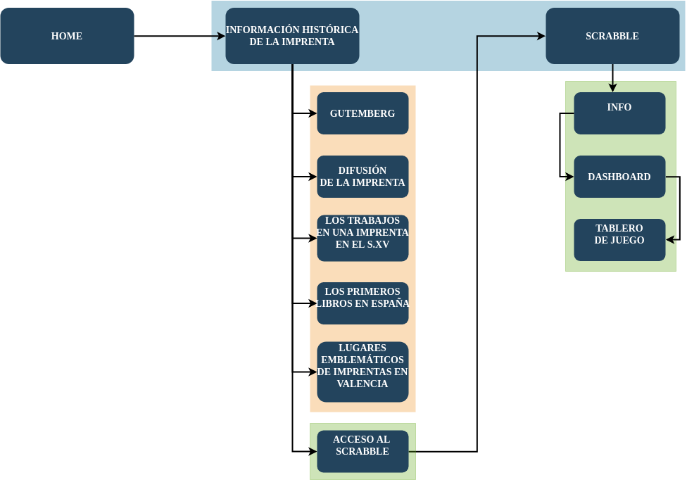
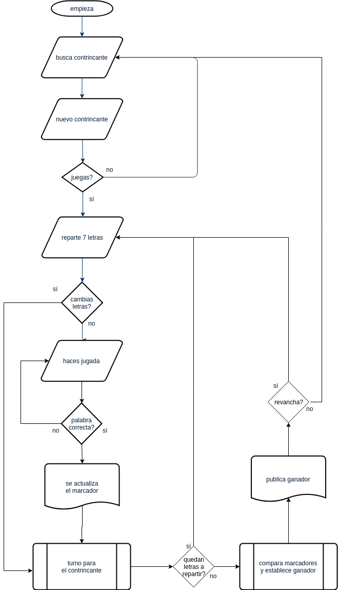
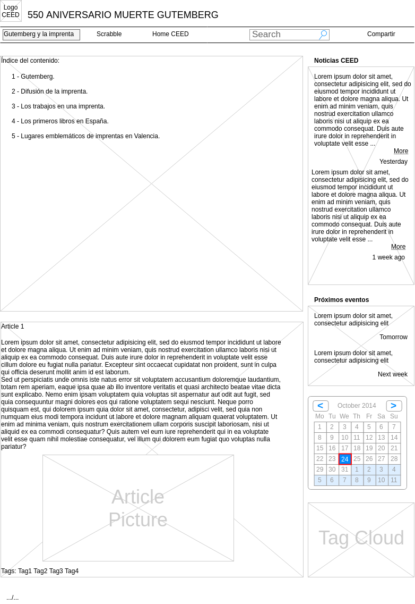
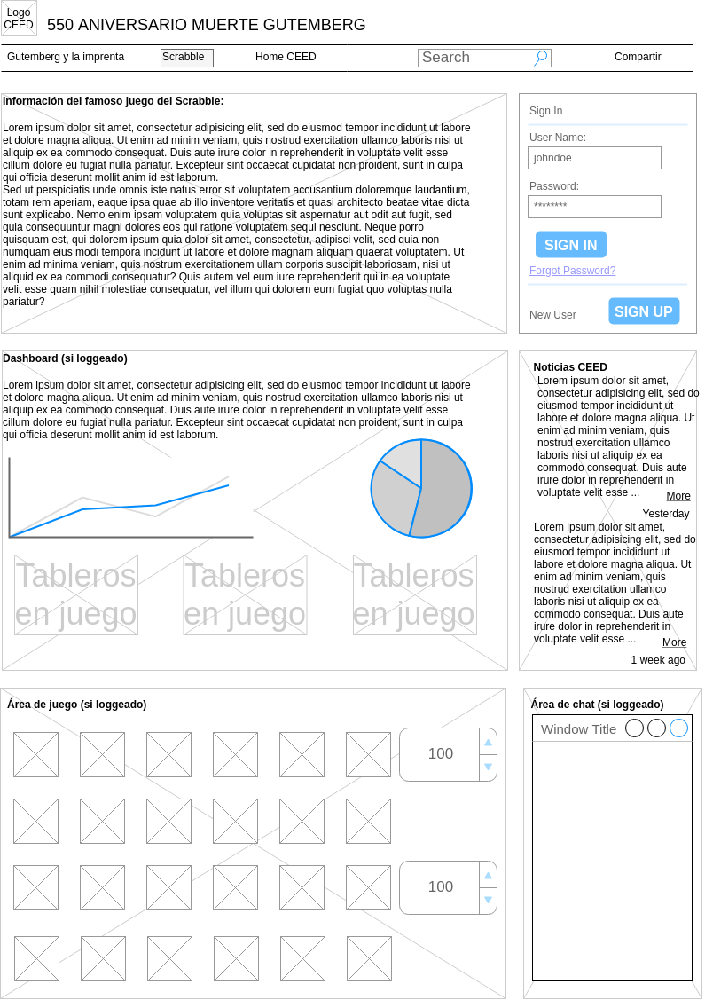
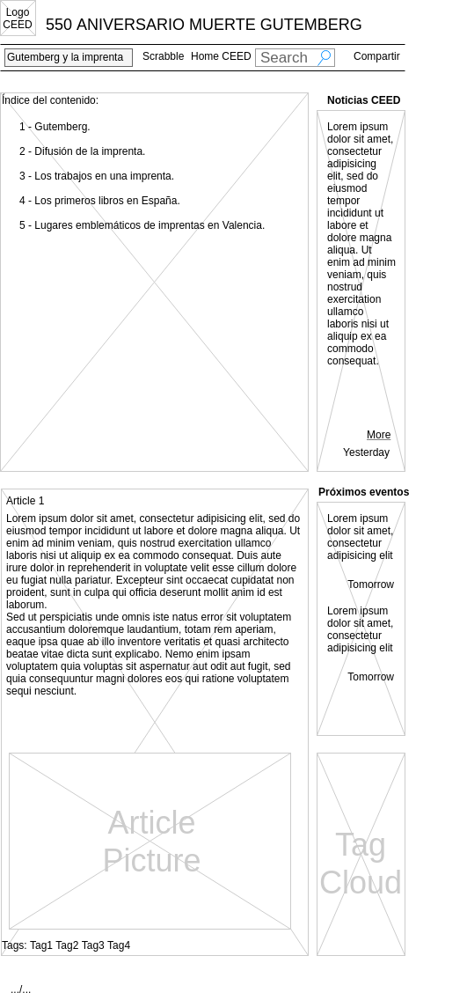
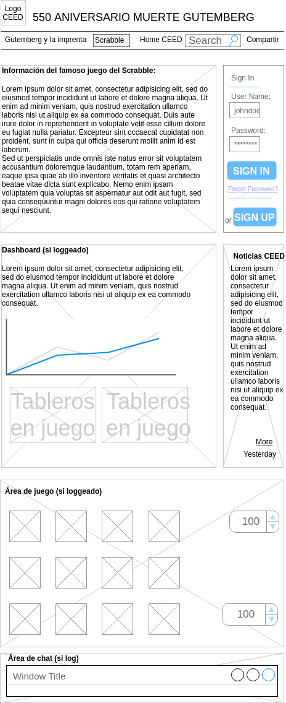
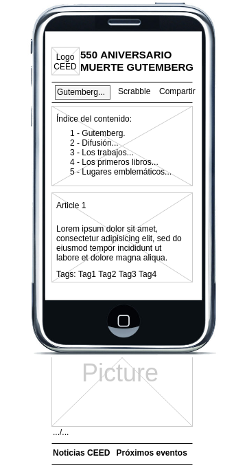
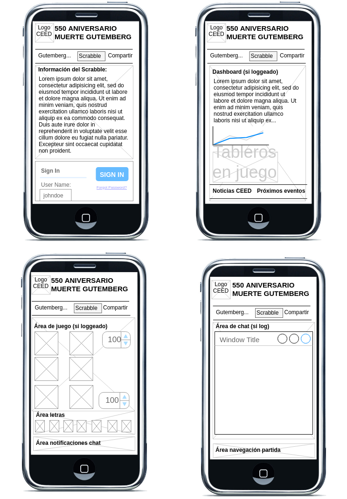

# PFM-F1. PLANIFICACIÓN
***

*CICLO DAW - MÓDULO DIW - 2018/2019*  
***ALUMNO:** VICENTE BATALLER GARCÍA*  
***

## ÍNDICE DE CONTENIDO:

1. Personas.
2. Mapa conceptual del área de Scrabble.
3. Mapa del sitio web.
4. Diagrama de flujo del desarrollo de una partida.
5. Modelos alámbricos de áreas y subáreas, en 3 versiones.
***

## 1. PERSONAS

**Nombre:** Joaquín Nguema.  
**Edad:** 17 años.  
**Descripción:** Alumno del CEED, cursando el bachiller. Hábil en las redes sociales y en los juegos de aventuras. Suele usar el ordenador de sobremesa de su habitación y el móvil cuando está fuera de casa. Es descendiente de emigrantes ya afincados en el país, no después de muchos problemas y conflictos. Es español de nacimiento pero así y todo nota cierta desconfianza de la gente en su trato con él.  
**Escenario:** Accede a la web buscando información sobre la imprenta para un trabajo de clase. No le interesa mucho el juego de letras pero a lo mejor se da de alta para probarlo. Se encuentra en la biblioteca del CEED probando el juego y le sorprende gratamente que puede agregar amigos a su dashboard para jugar con ellos. Algunos de los usuarios que encuentra son compañeros suyos de clase.  

**Nombre:** Rosa Reyerta.  
**Edad:** 62 años.  
**Descripción:** Ama de casa. Uso limitado del ordenador, para ocio y poco más. El ordenador lo tiene un poco obsoleto y suele hacer más uso de la tablet que le regalaron los hijos para Reyes. Suele pasar las tardes reunida con sus amigas en casa de alguna de ellas, donde después de merendar juegan alguna partida de cartas o cualquier otro juego de mesa. Se siente un poco sola porque su marido hace muchas horas en el trabajo y las reuniones de amigas le alivian un poco dicha soledad.  
**Escenario:** Por casualidad ha acabado en la web buscando información de Gutemberg en google. Le ha llamado la atención el juego Scrabble, que lo conoce y le gusta mucho. Probará a jugar aunque nunca ha jugado con otras personas por ordenador. Espera que el proceso de registro no sea excesivamente complicado.  

**Nombre:** María Oltra.  
**Edad:** 28 años.  
**Descripción:** Está interesada en cursar un ciclo formativo online y le gusta la opción que ofrece el CEED. Se defiende bastante bien con las nuevas tecnologías. Hace un uso intensivo de las redes sociales, por donde se comunica con sus amigos continuamente. Se considera inteligente y capaz pero ciertos hechos y situaciones en el pasado, la obligaron a abandonar los estudios y buscar trabajo antes de lo deseado. Es luchadora y trabajadora y confía poder completar los estudios que está a punto de empezar.  
**Escenario:** Buceando en el site del CEED ha llegado a nuestra web. Prueba el juego y le gustaría poder desactivar el chat, pues en otras ocasiones han intentado ligar con ella por ese medio, cosa que le ha parecido bastante desagradable. Por otro lado, agradece la información que aparece permanentemente sobre el CEED pues la pone sobre aviso de los eventos importantes.  

**Nombre:** Pepe Mel.  
**Edad:** 46 años.  
**Descripción:** Trabajador de la obra que en sus ratos libres usa el móvil para evadirse, conocer las noticias del día y consultar las redes sociales. Su situación económica no es muy boyante. Con 3 hijos en edad escolar y su mujer sin trabajo, le cuesta llegar a fin de mes y deben hacer malabares con las cuentas. Siempre le atrajo la tecnología y la ciencia y lamenta que sus padres no pudiesen costearle estudios más avanzados. La crisis pasada lo trató bastante mal y espera que esta recuperación que estamos viviendo dure lo suficiente para llegar a la jubilación con un mínimo de garantías, cosa que improbable y muy lejos en el tiempo.  
**Escenario:** Ha hecho una búsqueda del juego de apalabrados y ha llegado a la web que estamos planificando. No tiene mucho tiempo y le gustaría probar un poco el juego y ver qué tal va. Si le satisface puede que use el juego más a menudo en los cortos ratos libres que dispone a lo largo del día.  

***

## 2. MAPA CONCEPTUAL DEL ÁREA DE SCRABBLE

***

## 3. MAPA DEL SITIO WEB

***

## 4. DIAGRAMA DE FLUJO DEL DESARROLLO DE UNA PARTIDA
  

***

## 5. MODELOS ALÁMBRICOS DE ÁREAS Y SUBÁREAS

### 1. PARA ORDENADOR:

***
  

### 2. PARA TABLETA:

***
  

### 3. PARA MÓVIL:

***
